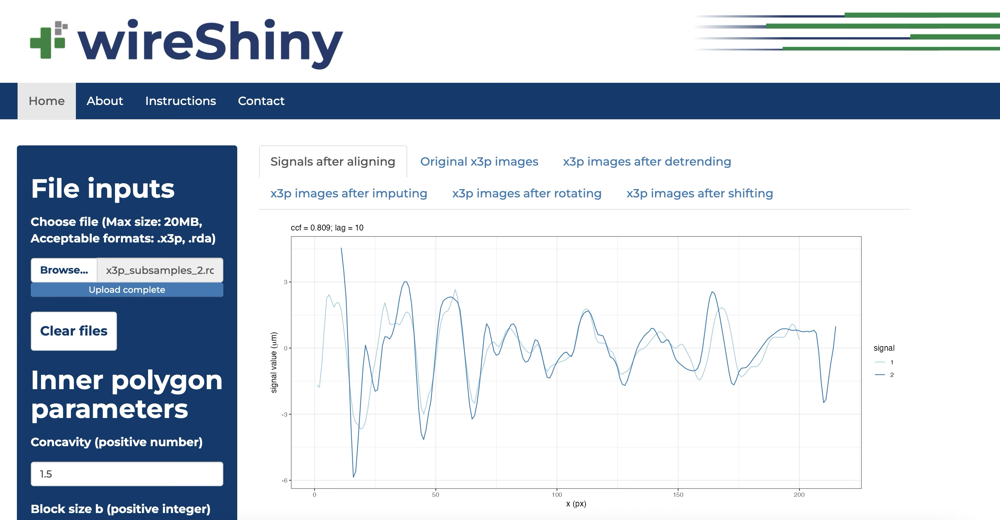

<!-- README.md is generated from README.Rmd. Please edit that file -->

# wireShiny 

<!-- badges: start -->

[](https://lifecycle.r-lib.org/articles/stages.html#experimental)
[](https://github.com/YuhangTom/wireShiny/commits/main)
[](https://CRAN.R-project.org/package=wireShiny)
[](https://github.com/YuhangTom/wireShiny/actions/workflows/R-CMD-check.yaml)
<!-- !!!Add with use_github_action!!! [](https://app.codecov.io/gh/YuhangTom/wireShiny?branch=main) -->
<!-- badges: end -->

The goal of wireShiny is to run the Shiny app based on the
functionalities of [`wire`](https://yuhangtom.github.io/wire/).

## Installation

You can install the development version of wireShiny from
[GitHub](https://github.com/) with:

``` r
# install.packages("devtools")
devtools::install_github("YuhangTom/wireShiny")
```

## Example

Use the following code to run the Shiny app.

``` r
library(wireShiny)

run_wireShiny()
```

A Shiny app like the one below will open in your default browser.


